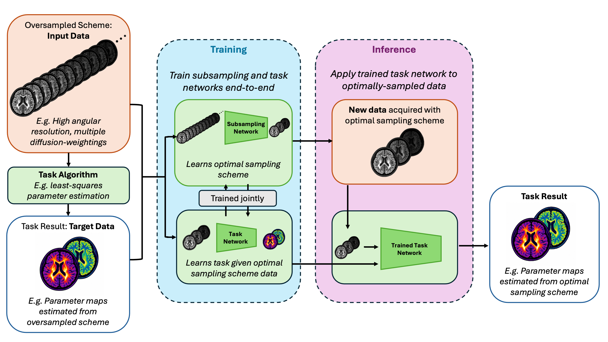

# EDMRI: A Machine Learning Framework for Experimental Design in Quantitative and Diffusion MRI

This is working code for an upcoming conference paper latest version [link](https://proceedings.iclr.cc/paper_files/paper/2024/hash/aec2dfc4f5e19acf05c15587c889dbc4-Abstract-Conference.html), and also an upcoming journal paper.

The neural-network based algorithm TADRED is available [here](https://github.com/sbb-gh/tadred).

If you find this repo useful, please consider citing the paper:

## Overview

This repo builds on the neural-network based algorithm TADRED (TAsk-DRiven Experimental Design in imaging) framework ([code](https://github.com/sbb-gh/tadred), [paper](https://proceedings.iclr.cc/paper_files/paper/2024/hash/aec2dfc4f5e19acf05c15587c889dbc4-Abstract-Conference.html)). The main additions are a series of wrapper functions that enable quick and easy optimisation of scanning protocols for quantitative and diffusion MRI.

The TADRED framework comprises a **subsampling network** and a **task nework**, which are trained jointly during optimisation. The subsampling network identifies the subpart of the data that bets supports a task, e.g. parameter mapping, and the task network is trained to undertake that task.


## Schematic



## Typical usage pipeline

The typical workflow we envisage for users of EDMRI is:

### 1. Oversampled data acquisition

- **Acquire oversampled MRI data** using a comprehensive "research-grade" acquisition scheme, which we refer to as the **superdesign**. This may be real MRI data or simulated data. *This oversampled dataset is the input data for TADRED.*
- **Perform the task on the oversampled data** to generate the corresponding task outputs. For example, for a parameter estimation task, this could involve fitting parameter maps using the complete superdesign dataset. *These task outputs are the target data for TADRED.*

### 2. Training

Run `optimise_experiment.py` on the paired inputs and targets from the superdesign dataset. This produces:

- An **optimised protocol**, consisting of a subset of the acquisitions in the superdesign.
- A **trained task network** for performing the target task using data acquired with the optimised protocol.

### 3. Inference

- **Acquire new data** using the optimised protocol.
- Run `apply_trained_model.py` to **apply the trained task network** to the new data and perform the specified task.

## Contact

stefano.blumberg.17@ucl.ac.uk

slatorp@cardiff.ac.uk


## Installation

We provide example instructions to first create an environment, then install packages within this environment.  We recommend users use an environment to isolate all modules from the global environment.

The steps below install everything in a top level directory called ```<INSTALL_DIR>``` which contains the virtual enviroment files, ED_MRI installation, and TADRED installation. This is the recommended structure and is assumed by some of the example notebooks.

We have given instuctions for a generic python version. We have sucessfully tested using various python versions but recommend using Python v3.10.4.  We recommend [pyenv](https://github.com/pyenv) for python version management.

The code is fully tested using PyTorch v2.0.0, cuda 11.7 on the GPU, dipy v1.5.0, nibabel v5.1.0, and dmipy v1.0.5.


### Installation Part 1: Directory set up
First create and move to the desired installation directory.

```
mkdir <INSTALL_DIR>
cd <INSTALL_DIR>
```

### Installation Part 2: ED_MRI repo
Clone this ED_MRI repo to ```<INSTALL_DIR>``` as follows.

```bash
git clone https://github.com/sbb-gh/ED_MRI.git
```

### Installation Part 3: TADRED repo
Now clone the relevant fork of the TADRED code to ```<INSTALL_DIR>``` as follows.

```bash
git clone https://github.com/PaddySlator/tadred.git
```

The relevant fork of the TADRED github repo is located [here](https://github.com/PaddySlator/tadred/tree/main).

<!--TODO: You can also use pip install (doesn't work on mac)

```bash
pip install git+https://github.com/sbb-gh/tadred.git@main
```-->


### Installation Part 4: Environment

Now create an activate a virtual environment in ```<INSTALL_DIR>```.  We provide two examples either using venv or Conda:

#### Option 1: Install Environment Using python venv module
The venv documentation is [here](https://docs.python.org/3/library/venv.html).

```bash
python -m venv .venv
source .venv/bin/activate
```

#### Option 2: Install Environment Using Conda
Conda documentation is [here](https://docs.conda.io/en/latest/).

```bash
conda create -n ED_MRI_env python=3.10.4
conda activate ED_MRI_env
```


### Installation Part 5: TADRED and Dependencies

Now install TADRED and the dependencies using pip.

After first updating pip, install TADRED

```bash
pip install --upgrade pip
cd tadred
pip install -e .
```

and then the additional dependencies

```bash
pip install notebook matplotlib scipy
```


<!--#### TADRED dependencies

TADRED requires pytorch, numpy, pyyaml, and hydra which can be installed as follows:

```bash
pip install torch==2.0.0 torchvision==0.15.1 torchaudio==2.0.1
pip install pyyaml hydra-core==1.3
pip install numpy
```

#### ED_MRI dependencies
Required to run the example jupyter notebooks:

```bash
pip install notebook
```-->

#### [Optional] Full dependencies for replication of results
Optional modules to generate the data and run a full replication of the results: dipy, dmipy, nibabel. Note that dmipy is no longer supported and can often be difficult to install. If you are struggling try cloning this repo https://github.com/PaddySlator/dmipy into ```<INSTALL_DIR>``` instead.


```bash
pip install git+https://github.com/AthenaEPI/dmipy.git@1.0.1
pip install dipy==1.9.0
pip install nibabel==5.1.0
```


<!--```bash
pip install numpy==1.23.4 git+https://github.com/AthenaEPI/dmipy.git@1.0.1
pip install dipy==1.9.0
pip install nibabel==5.1.0
pip install git+https://github.com/sbb-gh/tadred.git@main # can also install tadred from source to examine/modify files from www.github.com/sbb-gh/tadred
pip install notebook
```-->


<!--We provide two options for installing the code:-->

<!--#### Python Package from Source

```bash
pip install git+https://github.com/sbb-gh/ED_MRI.git@main notebook
```-->


<!--```bash
pip install numpy==1.23.4 git+https://github.com/AthenaEPI/dmipy.git@1.0.1
pip install dipy==1.9.0
pip install nibabel==5.1.0
pip install git+https://github.com/sbb-gh/tadred.git@main # can also install tadred from source to examine/modify files from www.github.com/sbb-gh/tadred
pip install notebook
```-->


## Quick start instructions: optimising an acquisition protocol from simulated data

We anticipant that many code users will want to design an acquisition scheme optimised for their model of choice. This can be done by following the steps in *optimise\_protocol\_from\_simulated\_data\_tutorial.ipynb.*

To summarize, the required steps are as follows.

### Step 1. Simulate data for a super-design acquisition scheme using your chosen
 model
A "super-design" is a rich acquisition scheme that covers the space of available acquisition parameters. For example to design a diffusion MRI experiment with maximum b-value 3 ms/μm<sup>2</sup>, an appropriate super design might be b=0, 0.01, 0.02, 0.03,..., 2.99, 3 ms/μm<sup>2</sup> with 20 gradient directions at each b-value (20 × 300 = 6000 total measurements).

To simulate data, you can utilise the signal equation of your model of choice (whether diffusion MRI or quantitative MRI). See *optimise\_protocol\_from\_simulated\_data_tutorial.ipynb* for an example

The output from your simulations should be three .npy files:

* *model\_name*\_parameters_gt.npy: array containing the simulation ground truth parameters
* *model\_name*\_signals_super.npy: array containing the simulation super-design signals
* *model\_name*\_signals_super.npy: array containing the simulation super-design acquisition parameters

### Step 2. Train TADRED on the simulated data

The above three files are then used as input for *optimise\_protocol\_from\_simulated\_data\_tutorial.ipynb.*

## Replicating Results in Paper

First install the environment and enter the environment, as explained above.  Then simply run

```bash
python paper_experiments.py
```

## Tutorial

We provide a more comprehensive and in depth
 tutorial [in tutorial.py](./examples/tutorial.py).  This provides an example of generating simple data, loading the data into TADRED, and various hyperparameter choices for TADRED with options to save the results.

